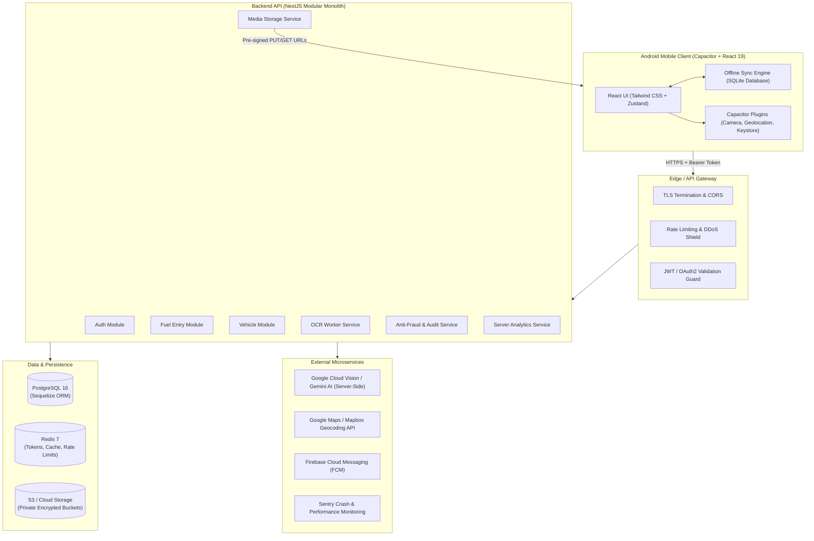

# Production Software Architecture, Security, QA & Google Play Audit: FuelTrack

**Author:** Senior Full-Stack, Mobile, Security & Android Release Architecture Group  
**Project:** FuelTrack Mobile Application  
**Current State:** MVP / Interactive Mobile Prototype (React 19 + Vite 8 + Capacitor 8 + Zustand)  
**Target State:** Production-grade, Google Play Store certified, Offline-First Android App + Enterprise Backend  
**Audit Date:** September 2026  
**Status:** AUDIT COMPLETED — AWAITING ARCHITECTURE APPROVAL PRIOR TO EXECUTION  

---

## 1. Executive Summary

### Release Verdict: **NOT READY FOR PRODUCTION / GOOGLE PLAY**

While FuelTrack exhibits a modern, polished dark-mode UI with sleek micro-interactions and an intuitive 2-photo flow, **it is currently an unhardened client-side prototype**. It cannot be published to Google Play or deployed to production in its current state.

### Key Architectural Blockers:
1. **Zero Backend & Server Validation:** All persistence lives in browser `localStorage` via Zustand (`fueltrack-storage-v1`). There is no multi-user isolation, database, or authoritative validation.
2. **Critical Security Hole (Exposed AI Credentials):** The application directly calls Google Gemini Vision APIs from client devices using an API key stored in plain `localStorage` or `VITE_GEMINI_API_KEY` (`src/services/geminiService.ts:65-75`).
3. **Violations of Third-Party Terms of Service:** Direct client-side HTTP calls to OpenStreetMap Nominatim (`src/services/locationService.ts:53, 98`) with generic User-Agent headers directly violate Nominatim's Acceptable Use Policy and risk IP blacklisting.
4. **Data Loss from Ephemeral Photo Paths:** Camera capture utilizes temporary cache paths (`_capacitor_file_` or `blob:`) that the Android operating system purges under memory pressure.
5. **Lint & React Hook Errors:** `npm run lint` fails with 3 critical React Hook rule violations in `src/pages/Processing.tsx` (conditional hook execution).
6. **Zero Automated Tests & Unsigned CI Builds:** The repository contains zero unit, integration, or E2E tests. The GitHub Actions workflow only compiles an unsigned debug APK rather than a signed Android App Bundle (`.aab`).
7. **Google Play Compliance Gaps:** Missing Privacy Policy URL, missing Data Safety declarations, non-compliant storage permissions (`WRITE_EXTERNAL_STORAGE`), lack of account deletion mechanisms, and `targetSdkVersion 36` (Android 16 preview, uncertified for current Play Store submission).

---

## 2. Architecture Scorecard

| Domain | Score | Status | Primary Remediation Required |
| :--- | :---: | :---: | :--- |
| **Frontend Architecture** | **5.5 / 10** | Needs Work | Fix React Hook violations in `Processing.tsx`, implement route-level code-splitting, add error boundaries, remove hardcoded fake data fallbacks. |
| **Backend Architecture** | **0.0 / 10** | **Critical** | Zero backend exists. Build modular NestJS REST API with Sequelize ORM, DTO validation, and transaction boundaries. |
| **Database & Persistence** | **1.0 / 10** | **Critical** | Migrate from 5MB `localStorage` to PostgreSQL + Sequelize backend, and implement SQLite for local mobile offline sync. |
| **Security & Auth** | **1.0 / 10** | **Critical** | Eliminate client-side Gemini API key; implement JWT/refresh token auth with Android Keystore, RBAC, and secure object storage signed URLs. |
| **Mobile & Capacitor** | **4.5 / 10** | Needs Work | Persist camera captures to permanent app storage; configure Android release signing, R8 minification, and proper splash/icons. |
| **Offline Synchronization** | **2.0 / 10** | **Critical** | Implement offline mutation queue with SQLite persistence, status flags (`PENDING`, `UPLOADING`, `SYNCED`, `FAILED`), and background sync retry. |
| **Testing & Quality Assurance** | **0.0 / 10** | **Critical** | Zero tests exist. Add Vitest + React Testing Library for frontend, Jest + Supertest for backend, and Playwright for E2E. |
| **Performance & Scalability** | **4.0 / 10** | Poor | 893 kB monolithic bundle; no pagination on history; full array reversals on client for charts; uncompressed photo uploads. |
| **Google Play Compliance** | **2.0 / 10** | **Critical** | Set `targetSdkVersion` to 35/34; strip deprecated storage permissions; create Privacy Policy, Data Safety disclosure, and account deletion endpoint. |
| **OVERALL SYSTEM SCORE** | **2.2 / 10** | **FAIL** | **Comprehensive architectural migration required before Google Play launch.** |

---

## 3. Current System Architecture (Phase 1 Audit)

### 3.1 Component & Page Hierarchy
```
App.tsx
└── RouterProvider
    └── MobileLayout.tsx (Header bar safe areas, Aurora Background, BottomNavigation)
        ├── Dashboard.tsx (Stats, greeting, recent entries)
        ├── AddFuel.tsx (Wizard entry point, camera check)
        ├── CaptureMeter.tsx (Camera trigger, fallback file picker, demo buttons)
        ├── Processing.tsx (Animated OCR stage progression)
        ├── CaptureVehicle.tsx (Dashboard camera trigger, GPS locator)
        ├── ReviewFuel.tsx (Final editable summary, confirm button)
        ├── FuelHistory.tsx (Search input, category filter, list)
        ├── FuelDetails.tsx (Detail breakdown, photo viewer, delete)
        ├── Analytics.tsx (Recharts charts, time selector tabs)
        └── Profile.tsx (Vehicle details edit, demo reset, Gemini API key modal)
```

### 3.2 Current Dependencies (`package.json`)
* React 19.2.8, React Router DOM 7.18.3, Zustand 5.0.15, Tailwind CSS 4.3.3
* Capacitor 8.5.1 (`@capacitor/android`, `@capacitor/camera`, `@capacitor/filesystem`, `@capacitor/geolocation`, `@capacitor/status-bar`)
* UI/Visualization: `recharts` 3.10.1, `lucide-react` 1.42.0, `clsx`, `tailwind-merge`
* Linter: `oxlint` 1.79.0 (exits with code 1)
* Build: Vite 8.2.2 with `@tailwindcss/vite` 4.3.3 and `@vitejs/plugin-react` 6.1.0

### 3.3 Data Persistence Flow
* Current: `useFuelStore` (`src/store/fuelStore.ts`) uses `zustand/middleware/persist` with standard Web `localStorage` under key `fueltrack-storage-v1`.
* Risk: Storing photo URIs or SVG base64 strings in `localStorage` quickly exceeds the 5MB browser quota, triggering `QuotaExceededError` and permanently crashing the app on startup.

### 3.4 External Services Audit
* **OCR:** Direct client calls to Google Generative Language API (`https://generativelanguage.googleapis.com/v1beta/models/...:generateContent`).
* **Reverse Geocoding & Nearby Bunks:** Direct client calls to OpenStreetMap Nominatim (`https://nominatim.openstreetmap.org/reverse` and `/search`).
* **Backend / Database / Object Storage:** Non-existent.

---

## 4. Target Production Architecture (Phase 2 & 3)



---

## 5. Normalized PostgreSQL Database Schema (Phase 4 & 5)

Per repository standards, Sequelize ORM with PostgreSQL is specified:

```sql
-- Users & Security
CREATE TABLE users (
    id UUID PRIMARY KEY DEFAULT gen_random_uuid(),
    email VARCHAR(255) UNIQUE NOT NULL,
    password_hash VARCHAR(255) NOT NULL,
    full_name VARCHAR(120),
    phone_number VARCHAR(20),
    is_active BOOLEAN DEFAULT TRUE,
    role VARCHAR(20) DEFAULT 'USER', -- USER, FLEET_MANAGER, ADMIN
    created_at TIMESTAMPTZ DEFAULT NOW(),
    updated_at TIMESTAMPTZ DEFAULT NOW(),
    deleted_at TIMESTAMPTZ
);

-- Vehicles
CREATE TABLE vehicles (
    id UUID PRIMARY KEY DEFAULT gen_random_uuid(),
    user_id UUID NOT NULL REFERENCES users(id) ON DELETE CASCADE,
    vehicle_number VARCHAR(32) NOT NULL,
    make_model VARCHAR(100) NOT NULL,
    fuel_type VARCHAR(20) NOT NULL, -- Petrol, Diesel, CNG, Electric
    tank_capacity NUMERIC(6,2),
    current_odometer INT NOT NULL DEFAULT 0,
    created_at TIMESTAMPTZ DEFAULT NOW(),
    updated_at TIMESTAMPTZ DEFAULT NOW(),
    deleted_at TIMESTAMPTZ,
    CONSTRAINT uq_user_vehicle UNIQUE (user_id, vehicle_number)
);

-- Fuel Stations
CREATE TABLE fuel_stations (
    id UUID PRIMARY KEY DEFAULT gen_random_uuid(),
    name VARCHAR(150) NOT NULL,
    brand VARCHAR(50), -- Indian Oil, BPCL, HPCL, Shell, Nayara
    address TEXT,
    latitude DOUBLE PRECISION NOT NULL,
    longitude DOUBLE PRECISION NOT NULL,
    created_at TIMESTAMPTZ DEFAULT NOW()
);

-- Fuel Entries (Master Transaction)
CREATE TABLE fuel_entries (
    id UUID PRIMARY KEY DEFAULT gen_random_uuid(),
    idempotency_key VARCHAR(128) UNIQUE NOT NULL,
    user_id UUID NOT NULL REFERENCES users(id) ON DELETE CASCADE,
    vehicle_id UUID NOT NULL REFERENCES vehicles(id) ON DELETE RESTRICT,
    fuel_station_id UUID REFERENCES fuel_stations(id),
    station_name_snapshot VARCHAR(150) NOT NULL,
    location_address_snapshot TEXT NOT NULL,
    latitude DOUBLE PRECISION NOT NULL,
    longitude DOUBLE PRECISION NOT NULL,
    gps_accuracy NUMERIC(6,2),
    fuel_type VARCHAR(20) NOT NULL,
    quantity NUMERIC(8,2) NOT NULL CHECK (quantity > 0),
    amount NUMERIC(10,2) NOT NULL CHECK (amount > 0),
    rate NUMERIC(8,2) NOT NULL CHECK (rate > 0),
    odometer INT NOT NULL CHECK (odometer >= 0),
    previous_odometer INT CHECK (previous_odometer >= 0),
    distance INT CHECK (distance >= 0),
    mileage NUMERIC(6,2) CHECK (mileage >= 0),
    sync_status VARCHAR(20) DEFAULT 'SYNCED', -- PENDING, SYNCED, FAILED
    verification_status VARCHAR(30) DEFAULT 'USER_CONFIRMED', -- AUTO_VERIFIED, USER_CONFIRMED, FLAGGED_FRAUD
    notes TEXT,
    captured_at TIMESTAMPTZ NOT NULL,
    created_at TIMESTAMPTZ DEFAULT NOW(),
    updated_at TIMESTAMPTZ DEFAULT NOW(),
    deleted_at TIMESTAMPTZ
);

-- Fuel Photos (Evidence)
CREATE TABLE fuel_photos (
    id UUID PRIMARY KEY DEFAULT gen_random_uuid(),
    fuel_entry_id UUID NOT NULL REFERENCES fuel_entries(id) ON DELETE CASCADE,
    photo_type VARCHAR(20) NOT NULL, -- DISPENSER_METER, VEHICLE_ODOMETER
    storage_path VARCHAR(512) NOT NULL, -- S3 object key
    sha256_hash CHAR(64) NOT NULL,
    file_size_bytes INT NOT NULL,
    mime_type VARCHAR(50) NOT NULL,
    captured_at TIMESTAMPTZ NOT NULL,
    uploaded_at TIMESTAMPTZ DEFAULT NOW()
);

-- OCR Audit & Confidence
CREATE TABLE ocr_results (
    id UUID PRIMARY KEY DEFAULT gen_random_uuid(),
    fuel_entry_id UUID NOT NULL REFERENCES fuel_entries(id) ON DELETE CASCADE,
    photo_id UUID REFERENCES fuel_photos(id),
    target_type VARCHAR(30) NOT NULL, -- METER, ODOMETER
    raw_ocr_payload JSONB NOT NULL,
    extracted_quantity NUMERIC(8,2),
    extracted_amount NUMERIC(10,2),
    extracted_rate NUMERIC(8,2),
    extracted_odometer INT,
    confidence_score NUMERIC(5,2) NOT NULL,
    was_manually_edited BOOLEAN DEFAULT FALSE,
    created_at TIMESTAMPTZ DEFAULT NOW()
);

-- Anti-Fraud & Integrity Audit Log
CREATE TABLE audit_logs (
    id UUID PRIMARY KEY DEFAULT gen_random_uuid(),
    user_id UUID REFERENCES users(id),
    fuel_entry_id UUID REFERENCES fuel_entries(id),
    action VARCHAR(50) NOT NULL, -- CREATE, UPDATE, DELETE, FRAUD_FLAG
    severity VARCHAR(20) NOT NULL, -- INFO, WARNING, CRITICAL
    flag_reason VARCHAR(255),
    metadata JSONB,
    client_ip VARCHAR(45),
    user_agent TEXT,
    created_at TIMESTAMPTZ DEFAULT NOW()
);

-- Strategic Indexes for High-Performance Queries
CREATE INDEX idx_fuel_entries_user_vehicle_date ON fuel_entries(user_id, vehicle_id, captured_at DESC);
CREATE INDEX idx_fuel_entries_odometer ON fuel_entries(vehicle_id, odometer DESC);
CREATE INDEX idx_fuel_stations_coords ON fuel_stations(latitude, longitude);
CREATE INDEX idx_audit_logs_user ON audit_logs(user_id, created_at DESC);
```

---

## 6. Anti-Fraud & OCR Integrity Architecture (Phases 6 & 7)

```mermaid
sequenceDiagram
    autonumber
    actor Driver as Mobile App (Driver)
    participant ClientStorage as SQLite / Cache
    participant API as NestJS API Gateway
    participant S3 as Private S3 Storage
    participant OCR as Backend Vision Engine
    participant DB as PostgreSQL + Audit Log

    Driver->>ClientStorage: Capture Dispenser Meter & Odometer Photos
    Driver->>ClientStorage: Record Device GPS & Timestamp
    Driver->>API: POST /api/v1/media/upload-tickets (Photo metadata, SHA256)
    API-->>Driver: Return Pre-signed S3 Upload URLs
    Driver->>S3: Direct Encrypted Upload (PUT multipart)
    Driver->>API: POST /api/v1/fuel-entries/process-ocr (Photo Keys, GPS)
    
    rect rgb(20, 30, 45)
        Note over API,OCR: Secure Server-Side Extraction
        API->>S3: Read Images securely
        API->>OCR: Execute Multimodal AI Extraction
        OCR-->>API: Litres, Amount, Rate, Odometer + Confidence Scores
        API->>API: Validate Rate (Rate ≈ Amount / Qty)
        API->>API: Query Previous Odometer & Check Continuity
        API->>API: Calculate Authoritative Distance & Mileage
    end

    API-->>Driver: Structured Validated Draft + Flags
    Driver->>Driver: Review UI (Driver edits or confirms)
    Driver->>API: POST /api/v1/fuel-entries (Idempotency-Key, Final Draft)
    
    rect rgb(35, 25, 30)
        Note over API,DB: Server Anti-Fraud Analysis
        API->>API: Check Idempotency Key
        API->>API: Check Odometer Regression (Current < Prev)
        API->>API: Check Fuel Volume vs Tank Capacity
        API->>API: Check Photo Hash Reuse (Duplicate receipt photo)
        API->>DB: Atomic Transaction: Save Entry + Photos + OCR Audit
    end

    API-->>Driver: 201 Created (Confirmed Fuel Entry)
```



### Authoritative Server-Side Fraud Checks:
1. **Odometer Decrement Guard:** `odometer < previousOdometer` raises a validation error or flags for manager review.
2. **Tank Capacity Ceiling:** If `quantity > vehicle.tankCapacity * 1.05`, reject or flag transaction.
3. **Receipt / Meter Photo Reuse Detection:** Each photo’s SHA-256 hash is checked against the last 90 days of transactions for that user and fleet. Duplicate image hashes are rejected immediately.
4. **Distance & GPS Plausibility:** If `distance / timeDifference > 140 km/h` (impossible speed) or distance between sequential GPS coordinates exceeds physical travel feasibility, transaction is marked `SUSPICIOUS`.
5. **Idempotency Enforcement:** Multi-tapping "Confirm & Save" sends a client-generated UUID idempotency key; duplicate requests return the existing record without duplicate charges.

---

## 7. Comprehensive Risk Register (Phase 34 Audit Findings)

| ID | Severity | File / Component | Current Implementation | Problem & Risk | Recommended Production Solution | Complexity | Priority |
| :---: | :---: | :--- | :--- | :--- | :--- | :---: | :---: |
| **SEC-01** | **CRITICAL** | `src/services/geminiService.ts:65-75` | Reads API key from `localStorage` or `VITE_GEMINI_API_KEY`. | Client API key exposure; token theft; quota hijacking; consumer user cannot provide keys. | Move all AI OCR processing to NestJS backend; client never touches API keys. | Medium | **P0** |
| **SEC-02** | **CRITICAL** | `src/store/fuelStore.ts` | Whole application state stored in Web `localStorage`. | No authentication; no data encryption; 5MB quota crash with base64 images; no multi-user privacy. | Implement PostgreSQL + JWT auth backend; use local SQLite database on mobile for offline cache. | High | **P0** |
| **SEC-03** | **CRITICAL** | `android/.../AndroidManifest.xml:42-43` | Requests `READ_EXTERNAL_STORAGE` & `WRITE_EXTERNAL_STORAGE`. | Fails Google Play Target SDK 34/35 compliance. Scrutinized and rejected by Google Play reviewers. | Remove external storage permissions. Use scoped app internal storage (`FilesystemDirectory.Data`). | Low | **P0** |
| **LINT-01**| **CRITICAL** | `src/pages/Processing.tsx:30-65` | Hooks (`useState`, `useEffect`) called after early `return null`. | Violates React Rules of Hooks. Causes React 19 runtime crashes, memory leaks, and broken renders. | Reorder hooks unconditionally to top of component before any conditional return guards. | Low | **P0** |
| **MOB-01** | **HIGH** | `src/services/cameraService.ts:25` | Uses `image.webPath` temporary cache URI directly in store. | OS cleans cache directory on app restart or memory pressure, causing broken images in logs. | Copy captured image to persistent private app directory (`Filesystem.copyFile`) before saving. | Medium | **P0** |
| **MOB-02** | **HIGH** | `android/.../build.gradle:21` | `minifyEnabled false` in release build type. | Code not shrunk or obfuscated; reverse-engineering vulnerability; APK bloat. | Enable R8 minification (`minifyEnabled true`), configure ProGuard rules for Capacitor & Recharts. | Low | **P1** |
| **MOB-03** | **HIGH** | `android/variables.gradle:3-4` | `targetSdkVersion = 36` (Android 16 preview). | API 36 is uncertified for standard Google Play submission in 2026; causes stability and store rejection. | Set `targetSdkVersion = 35` (Android 15) or 34 in accordance with current Google Play policies. | Low | **P0** |
| **API-01** | **HIGH** | `src/services/locationService.ts:53, 98`| Direct client queries to OpenStreetMap Nominatim. | Violates Nominatim TOS (banned mobile client direct queries); IP will be blocked; Kelambakkam fallback bug. | Route geocoding through backend proxy with Redis caching or use Google Maps / Radar API. | Medium | **P1** |
| **DATA-01**| **HIGH** | `src/store/fuelStore.ts:121-142` | Hardcodes fake fallback numbers (`32.45`, `3245`, `48625`) on missing OCR. | Fraud risk; invalid data silently saved as real verified transaction without warning. | Explicitly require manual user input when OCR fails; never fabricate synthetic transaction values. | Medium | **P0** |
| **PERF-01**| **MEDIUM** | `dist/assets/index-*.js` (893 kB) | Monolithic SPA bundle without route lazy loading. | Slow mobile startup, high RAM consumption on low-end Android devices. | Implement `React.lazy` and `Suspense` for all pages (`Dashboard`, `AddFuel`, `Analytics`, `History`). | Low | **P1** |
| **PERF-02**| **MEDIUM** | `src/pages/FuelHistory.tsx:98` | Renders entire array without pagination. | DOM bloating and frame drops when history exceeds 100 entries. | Implement virtualized list or backend pagination (`limit=20&cursor=...`). | Medium | **P1** |
| **DATA-02**| **MEDIUM** | `src/pages/Analytics.tsx:63-76` | Time range filter state exists but is ignored by chart data mapper. | User selects 7D / 30D / 6M and sees identical unfiltered data. | Wire `timeRange` filter logic into `chartData` calculation or fetch aggregated server metrics. | Low | **P1** |
| **TEST-01**| **HIGH** | Repository Root | Zero unit, integration, or E2E tests configured. | High regression risk; cannot verify critical fuel calculation math or OCR pipelines. | Add Vitest + Testing Library tests for math, stores, and wizard flows; Supertest for API. | Medium | **P0** |
| **PLAY-01**| **CRITICAL** | Store Compliance | Missing Privacy Policy, Data Safety Form, Account Deletion. | Mandatory Google Play requirements; app cannot be submitted without these. | Deploy public Privacy Policy; implement `/api/v1/users/me` DELETE endpoint; document Data Safety. | Medium | **P0** |

---

## 8. Mobile & Capacitor Security Audit (Phases 8, 9, 10, 19, 21)

### 8.1 Android Permissions Audit Table

| Permission | Current Location | Justification / Usage | Required for MVP? | Play Store Policy Risk | Action |
| :--- | :--- | :--- | :---: | :---: | :--- |
| `android.permission.INTERNET` | `AndroidManifest.xml:40` | API synchronization, secure upload. | **YES** | None (Normal) | **Retain** |
| `android.permission.CAMERA` | `AndroidManifest.xml:41` | Photo capture of meter & odometer. | **YES** | Runtime permission required | **Retain & ensure runtime prompt rationale** |
| `android.permission.ACCESS_FINE_LOCATION` | `AndroidManifest.xml:45` | Auto-detect fuel station coordinates. | **YES** | High scrutiny | **Retain coarse+fine; explain in Data Safety** |
| `android.permission.ACCESS_COARSE_LOCATION` | `AndroidManifest.xml:44` | Approximate locality fallback. | **YES** | Medium | **Retain** |
| `android.permission.READ_EXTERNAL_STORAGE` | `AndroidManifest.xml:42` | Legacy storage access. | **NO** | **HIGH (Play Store Rejection on API 33+)** | **REMOVE IMMEDIATELY** |
| `android.permission.WRITE_EXTERNAL_STORAGE`| `AndroidManifest.xml:43` | Legacy storage write. | **NO** | **HIGH (Play Store Rejection on API 33+)** | **REMOVE IMMEDIATELY** |
| `android.permission.ACCESS_BACKGROUND_LOCATION` | Not requested | Unnecessary background tracking. | **NO** | Critical Play Store Audit | **DO NOT ADD** |

### 8.2 Image Handling Architecture
1. **Capture:** Capture photo via `@capacitor/camera` with quality 80, dimensions scaled to max 1920x1080.
2. **Client Compression:** Pre-compress image in native memory using Canvas/WebP to ensure file size is under 800 KB before upload.
3. **Local Private Persistence:** Store locally in `FilesystemDirectory.Data` (`/data/user/0/com.fueltrack.app/files/`) inaccessible to other apps.
4. **Pre-signed Upload:** Mobile client requests upload ticket from backend, receiving a time-limited (10-minute) S3 pre-signed PUT URL with enforced `Content-Type: image/jpeg` and `Content-Length-Range` constraints.
5. **No Public Bucket Access:** S3 bucket blocks all public access. Displaying images in mobile history uses short-lived pre-signed GET URLs generated by the API.

---

## 9. Google Play Pre-Launch Compliance Checklist (Phases 20 & 32)

* [ ] **Target Android SDK:** Verified `targetSdkVersion = 35` (Android 15) in `android/variables.gradle`.
* [ ] **Android Package Namespace:** Replaced default placeholder with registered company domain ID.
* [ ] **Version Code & Version Name:** Managed sequentially (`versionCode 100`, `versionName "1.0.0"`).
* [ ] **Adaptive App Icons:** High-resolution vector foreground/background in `res/mipmap-anydpi-v26/` matching Play guidelines.
* [ ] **Android 12+ Splash Screen API:** Configured `core-splashscreen` themes without blank white flash.
* [ ] **R8 Code Obfuscation:** Enabled `minifyEnabled true` and `shrinkResources true` in `buildTypes.release`.
* [ ] **Release Keystore & Play App Signing:** Keystore stored in GitHub Actions encrypted secrets; signed AAB compiled via `bundleRelease`.
* [ ] **Public Privacy Policy URL:** Live HTTPS page detailing camera usage, precise GPS location, photo storage duration, and contact details.
* [ ] **Google Play Data Safety Form:**
  * Location: Precise Location (Collected for fuel transaction records, not shared with brokers).
  * Personal Info: Name, Email (Collected for account authentication).
  * Photos/Videos: Photos (Collected for OCR verification and audit records).
  * Financial Info: Purchase info / fuel expenses (Collected for personal tracking).
* [ ] **Account Deletion Requirement (Play Policy):** Dedicated in-app "Delete My Account" button that immediately deletes all personal data, vehicles, and photos, plus an external web form for requesting deletion without reinstalling the app.
* [ ] **Zero Debug Code in Release:** Stripped `console.log`, demo modes, mock data switches, and developer modals from production builds.

---

## 10. Architecture Decision Record (ADR 001 - Production Architecture)

### Context
The application currently runs as a standalone client SPA with simulated backend behavior in `localStorage`, direct client AI calls, and unhardened mobile configs. To deploy to Google Play as a commercial-grade app, a resilient, secure architecture is required.

### Decisions
1. **Backend FraFuel Trackork: NestJS (TypeScript):** Adhere to the established repository standards (`rules/backend-standards.md`). Use modular architecture (`auth`, `users`, `vehicles`, `fuel-entries`, `ocr`, `media`, `analytics`).
2. **Database & ORM: PostgreSQL + Sequelize:** Adhere to `rules/database.md`. Full relational integrity, foreign keys, transactions, and migration scripts.
3. **OCR Processing: Server-Side Multimodal AI:** Offload OCR to backend services. Protect API keys, validate mathematically (Rate = Amount / Qty), verify image continuity, and calculate authoritative odometer distance.
4. **Offline Strategy: SQLite Local Store + Sync Worker:** Replace `localStorage` on mobile with `@capacitor-community/sqlite`. Store pending entries with state `PENDING` and sync automatically when network connectivity is restored.
5. **Release Distribution: Android App Bundle (.aab):** Target SDK 35, strip legacy permissions, configure R8 optimization, and automate signing in CI/CD.

### Consequences
* **Positive:** Enterprise security, zero key leakage, Google Play compliance, multi-device sync, fraud prevention, offline reliability, testable codebase.
* **Negative:** Requires standing up cloud backend infrastructure and database; adds slight complexity to local dev environment.

---

## 11. Step-by-Step Implementation Roadmap (Phases 33 & 35)

```
Phase 1: Codebase Hardening & Bug Fixes (P0)
└── Fix React Rules of Hooks in Processing.tsx
└── Eliminate hardcoded fake fallback data
└── Fix AndroidManifest.xml permissions (remove external storage)
└── Set targetSdkVersion to 35

Phase 2: NestJS + Sequelize Backend Foundation (P0)
└── Initialize NestJS modular monolith
└── Configure Sequelize ORM & PostgreSQL database connection
└── Write migration scripts for users, vehicles, fuel_entries, photos, ocr_results
└── Implement JWT authentication, refresh tokens, and password hashing

Phase 3: Media & Server-Side OCR Pipeline (P0)
└── Implement secure S3 pre-signed upload tickets
└── Server-side Gemini Vision OCR worker
└── Cross-field math validation (Amount / Qty = Rate)
└── Authoritative odometer calculation & fraud detection

Phase 4: Mobile Offline-First Engine (P0)
└── Integrate @capacitor-community/sqlite on mobile
└── Implement background synchronization queue (PENDING -> SYNCED)
└── Local photo persistence in FilesystemDirectory.Data

Phase 5: Automated Testing Suite (P0)
└── Vitest unit tests for fuel calculation math & state machines
└── Backend integration tests with Supertest
└── Playwright E2E tests for the full 2-photo flow

Phase 6: Google Play Release Preparation & Hardening (P0)
└── R8/ProGuard configuration & testing
└── Production Keystore & GitHub Actions release workflow (bundleRelease)
└── Deploy Privacy Policy & in-app Account Deletion
└── Internal Testing Track deployment on Google Play Console
```

---

## 12. Verification & Acceptance Criteria

Prior to Google Play submission, the release gate requires 100% pass on:
1. `npm run lint` exits code 0 with 0 warnings.
2. `npm run test` executes unit & integration test suites with 100% pass.
3. `npm run build` compiles Vite bundle with route chunking (<250 kB initial bundle).
4. `./gradlew bundleRelease` compiles signed `.aab` with R8 minification enabled.
5. End-to-end offline flow test:
   * Disconnect device network -> Capture 2 photos -> Confirm -> Record saved locally as `PENDING`.
   * Reconnect device network -> Background worker uploads photos, runs OCR, synchronizes with PostgreSQL -> Record transitions to `SYNCED`.
   * Re-opening app or clearing app cache preserves all photos and verified logs.
