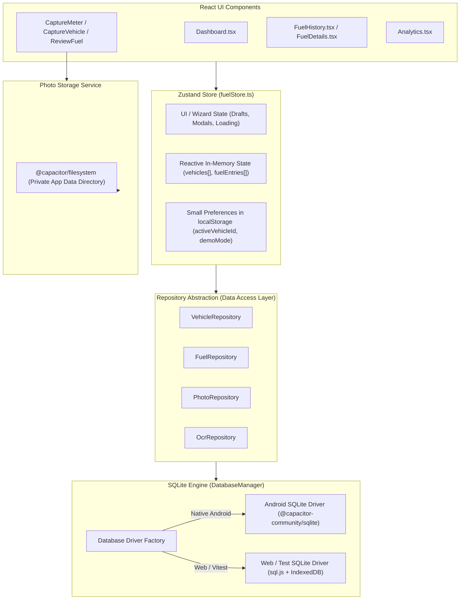

# Implementation Plan: Phase 2 — Frontend Local Database (SQLite) + Complete Testing Suite

**Objective:**  
Convert FuelTrack's frontend from volatile `localStorage` persistence into an offline-first, local SQLite database architecture suitable for Android device execution, backed by clean repository abstractions, persistent photo management via Capacitor Filesystem, Zod validation, mockable service interfaces, and an exhaustive automated test suite (Vitest + React Testing Library).

---

## 1. Architecture Overview & Repository Pattern



---

## 2. SQLite Database Schema & Tables

All tables will be created in private app storage (`fueltrack.db`) with `PRAGMA foreign_keys = ON;`.

### 2.1 `vehicles`
* `id TEXT PRIMARY KEY` (UUID / prefixed ID)
* `vehicleNumber TEXT NOT NULL UNIQUE`
* `makeModel TEXT NOT NULL`
* `fuelType TEXT NOT NULL` (Petrol, Diesel, CNG, Electric)
* `tankCapacity REAL DEFAULT 0`
* `currentOdometer INTEGER NOT NULL DEFAULT 0`
* `isActive INTEGER NOT NULL DEFAULT 1`
* `createdAt TEXT NOT NULL`
* `updatedAt TEXT NOT NULL`

### 2.2 `fuel_entries`
* `id TEXT PRIMARY KEY`
* `vehicleId TEXT NOT NULL REFERENCES vehicles(id) ON DELETE RESTRICT`
* `capturedAt TEXT NOT NULL`
* `fuelStationName TEXT NOT NULL`
* `locationAddress TEXT NOT NULL`
* `latitude REAL NOT NULL`
* `longitude REAL NOT NULL`
* `fuelType TEXT NOT NULL`
* `quantity REAL NOT NULL CHECK (quantity > 0)`
* `amount REAL NOT NULL CHECK (amount > 0)`
* `rate REAL NOT NULL CHECK (rate >= 0)`
* `odometer INTEGER NOT NULL CHECK (odometer >= 0)`
* `previousOdometer INTEGER CHECK (previousOdometer >= 0)`
* `distance INTEGER CHECK (distance >= 0)`
* `mileage REAL CHECK (mileage >= 0)`
* `verificationStatus TEXT NOT NULL DEFAULT 'USER_CONFIRMED'`
* `notes TEXT`
* `createdAt TEXT NOT NULL`
* `updatedAt TEXT NOT NULL`
* `deletedAt TEXT`

### 2.3 `fuel_photos`
* `id TEXT PRIMARY KEY`
* `fuelEntryId TEXT NOT NULL REFERENCES fuel_entries(id) ON DELETE CASCADE`
* `photoType TEXT NOT NULL CHECK (photoType IN ('METER', 'VEHICLE'))`
* `localPath TEXT NOT NULL` (relative or absolute path in `FilesystemDirectory.Data`)
* `fileName TEXT NOT NULL`
* `capturedAt TEXT NOT NULL`
* `createdAt TEXT NOT NULL`

### 2.4 `ocr_results`
* `id TEXT PRIMARY KEY`
* `fuelEntryId TEXT NOT NULL REFERENCES fuel_entries(id) ON DELETE CASCADE`
* `fieldName TEXT NOT NULL` (quantity, amount, rate, odometer)
* `extractedValue REAL NOT NULL`
* `confidence REAL NOT NULL`
* `source TEXT NOT NULL` (GEMINI_FLASH, ML_KIT, MOCK_DEMO, MANUAL_EDIT)
* `createdAt TEXT NOT NULL`

### 2.5 Strategic Indexes
* `CREATE INDEX idx_fuel_entries_vehicle_captured ON fuel_entries(vehicleId, capturedAt DESC);`
* `CREATE INDEX idx_fuel_entries_captured ON fuel_entries(capturedAt DESC);`
* `CREATE INDEX idx_fuel_photos_entry ON fuel_photos(fuelEntryId);`
* `CREATE INDEX idx_ocr_results_entry ON ocr_results(fuelEntryId);`

---

## 3. Database Initialization & Multi-Platform Driver

A unified `DatabaseDriver` interface:
```typescript
export interface DatabaseDriver {
  execute(sql: string, params?: any[]): Promise<void>
  query<T = any>(sql: string, params?: any[]): Promise<T[]>
  runTransaction<T>(callback: (tx: DatabaseDriver) => Promise<T>): Promise<T>
  close(): Promise<void>
}
```
* **Android Native:** Uses `@capacitor-community/sqlite` (`CapacitorSQLite.createConnection`).
* **Web / Desktop Vite / Vitest:** Uses `sql.js` (WebAssembly SQLite) with IndexedDB persistence in the browser, and in-memory execution in Vitest.
* **Seeding:** On fresh launch, if the `vehicles` table is empty, seed with initial mock data (`TN 09 BX 4821` and starter fuel history) so the user has immediate rich data.

---

## 4. Repository Implementations

### `VehicleRepository`
* `getAll(): Promise<Vehicle[]>`
* `getById(id: string): Promise<Vehicle | null>`
* `getActive(): Promise<Vehicle | null>`
* `create(vehicle: Omit<Vehicle, 'createdAt' | 'updatedAt'>): Promise<Vehicle>`
* `update(id: string, updates: Partial<Vehicle>): Promise<Vehicle>`
* `updateOdometer(id: string, newOdometer: number): Promise<void>`
* `delete(id: string): Promise<boolean>`

### `FuelRepository`
* `createWithTransaction(entry: FuelEntryInput, photos: PhotoInput[], ocr: OcrInput[]): Promise<FuelEntry>`
  * Executes atomic `BEGIN TRANSACTION`:
    1. Insert fuel entry record
    2. Insert meter and vehicle photo records
    3. Insert OCR extraction and confidence audit records
    4. Update vehicle's `currentOdometer`
    5. `COMMIT`
  * If any step fails: `ROLLBACK` and propagate structured error.
* `getById(id: string): Promise<FuelEntryDetail | null>`
* `getAll(filter?: { vehicleId?: string; dateFrom?: string; dateTo?: string; search?: string }): Promise<FuelEntry[]>`
* `delete(id: string): Promise<boolean>`
* `getAnalytics(vehicleId?: string, timeRange?: '7D' | '30D' | '3M' | '6M'): Promise<AnalyticsMetrics>`

---

## 5. Persistent Photo Storage Service

* **Module:** `src/services/photoStorageService.ts`
* **Behavior:**
  * Takes captured photo URI (temporary cache from `@capacitor/camera` or blob URL).
  * Generates unique filename: `fuel_meter_<timestamp>_<uuid>.jpg` and `fuel_vehicle_<timestamp>_<uuid>.jpg`.
  * Reads data and writes permanently to `@capacitor/filesystem` under `Directory.Data` (`/data/user/0/com.fueltrack.app/files/photos/`).
  * Returns stored permanent path.
  * In browser fallback: persists to IndexedDB or local blob store so photos never disappear on reload.

---

## 6. Zod Validation Layer

* **Module:** `src/validation/fuelValidation.ts`
* **Rules:**
  * `quantity`: `z.number().positive("Quantity must be greater than 0")`
  * `amount`: `z.number().positive("Amount must be greater than 0")`
  * `rate`: `z.number().nonnegative()`
  * `odometer`: `z.number().int().nonnegative()`
  * `tankCapacity`: `z.number().positive().optional()`
  * `continuity`: Odometer must be `>= previousOdometer` (or requires explicit user override confirmation)
  * `mileage`: `distance / quantity` must be finite and `>= 0`.

---

## 7. Service Interfaces & Mock Adapters

* **OCR:**
  * Interface: `IOCRService` (`analyzeFuelMeter`, `analyzeOdometer`)
  * `MockOCRService`: Deterministic readings for unit tests and offline testing.
  * `GeminiOCRService`: Multimodal AI reading when online / configured.
* **Location:**
  * Interface: `ILocationService` (`getCurrentLocation`, `resolveCurrentLocationDetails`)
  * `MockLocationService`: Coordinates and station name resolver for tests / offline mode.
  * `RealLocationService`: Capacitor Geolocation + OpenStreetMap resolver.

---

## 8. Zustand Store Modernization

* Remove `fuelEntries` and `vehicles` from `localStorage` persist configuration.
* Keep only lightweight UI settings in `localStorage` (`activeVehicleId`, `demoMode`, `theme`).
* Add methods:
  * `loadInitialData(): Promise<void>` (fetches vehicles and entries from repositories into reactive memory)
  * `confirmAndSaveDraft(): Promise<FuelEntry | null>` (calls `FuelRepository.createWithTransaction`)
  * `deleteFuelEntry(id: string): Promise<boolean>` (calls repository then updates state)
  * `updateActiveVehicle(updates): Promise<void>` (calls repository then updates state)

---

## 9. Comprehensive Testing Strategy

### 9.1 Test Tooling
* **Test Runner:** `vitest run`
* **DOM Environment:** `jsdom`
* **Assertions & Component Helpers:** `@testing-library/react`, `@testing-library/jest-dom`, `@testing-library/user-event`
* **Configuration:** `vitest.config.ts`

### 9.2 Test Suites
1. **Unit Tests (`tests/unit/`):**
   * `fuelCalculations.test.ts`: Distance, mileage, rate, cost/km, division by zero, invalid numbers.
   * `fuelValidation.test.ts`: Zod schema validation, boundary checks, tank capacity warnings.
   * `repositories.test.ts`: CRUD operations on in-memory SQLite database, transaction rollback verification, duplicate prevention, foreign keys.
   * `store.test.ts`: Zustand store loading, draft management, successful save, validation errors.
2. **Component Tests (`tests/components/`):**
   * `CaptureMeter.test.tsx`: Renders correctly, accepts valid manual input, blocks invalid zero/negative inputs.
   * `CaptureVehicle.test.tsx`: Renders correctly, validates odometer.
   * `ReviewFuel.test.tsx`: Correctly displays summaries, handles user edits, blocks save when invalid, displays error banner.
   * `FuelHistory.test.tsx`: Lists entries, filters by search query and category, handles empty states.
   * `Analytics.test.tsx`: Computes metrics across 7D, 30D, 3M, 6M, handles empty datasets.
3. **Integration / E2E Test (`tests/e2e/`):**
   * `fuelEntryWorkflow.test.tsx`: Complete happy-path execution:
     `Load App -> Add Fuel -> Scan Meter -> Scan Odometer -> Review -> Save -> Verify SQLite -> Verify History -> Verify Analytics`.
   * Negative scenarios: Attempt save with 0 volume, database transaction failure rollback.

---

## 10. Seed Dataset Generator for Performance Testing

* A script/utility `src/database/seed.ts` capable of generating ~10 vehicles and ~500 fuel entries distributed over 12 months with calculated distance and mileage.
* Verifies indexed SQL queries run in `<15ms`.

---

## 11. Verification Plan

1. `npm run lint` exits code 0 with 0 warnings.
2. `npm run test` executes all unit, repository, component, and E2E test suites with 100% pass.
3. `npm run build` compiles Vite bundle without errors.
4. `npx cap sync android` syncs without error.

---

## User Review Required

> [!IMPORTANT]
> This plan replaces `localStorage` persistence with local SQLite database storage across all app pages. It does NOT touch any backend servers, cloud databases, or external infrastructure, keeping the app 100% local, testable, and backend-ready.
